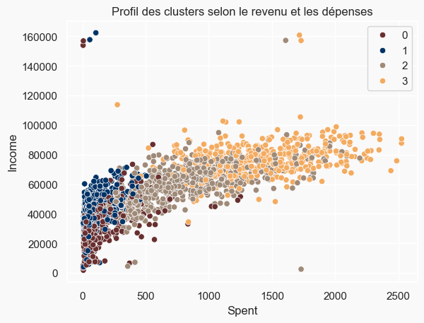
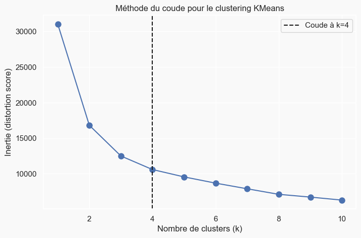
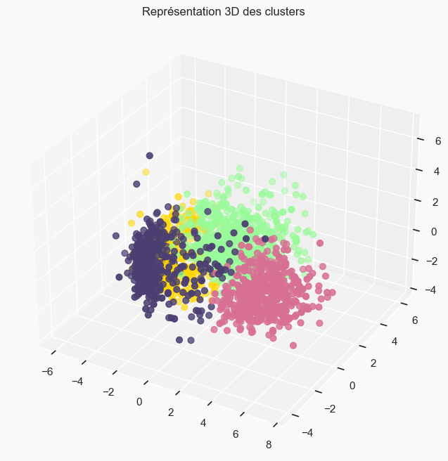
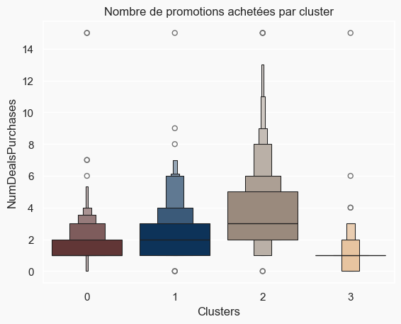

# Segmentation de la clientèle par clustering non supervisé

Identification de **4 segments de clients** homogènes à partir de 2 212 clients d'une enseigne de grande distribution, pour permettre un ciblage marketing différencié plutôt qu'une communication uniforme.

**Résultat clé :** les segments identifiés se distinguent nettement sur le couple revenu / dépenses, et surtout sur la **réceptivité aux promotions** — le segment le plus dépensier n'est pas celui qui répond le mieux aux offres. Ce résultat contre-intuitif invalide la stratégie promotionnelle uniforme.



---

## Contexte

Projet académique réalisé en équipe dans le cadre du cours de Data Mining, **ENSEA Abidjan, promotion AS3 — juillet 2025**.

L'énoncé posait le problème du point de vue de l'entreprise : disposant d'une base de 2 240 clients, comment constituer des groupes homogènes permettant de proposer des offres ciblées plutôt qu'une offre unique ?

## Données

`marketing_campaign.csv` — 2 240 clients, 29 variables, jeu de données public *Customer Personality Analysis*.

Les variables couvrent quatre dimensions :

| Dimension | Variables | Exemples |
|---|---|---|
| Profil socio-démographique | 10 | année de naissance, niveau d'éducation, statut matrimonial, revenu du ménage, enfants et adolescents à charge |
| Dépenses sur 2 ans | 6 | vin, fruits, viande, poisson, sucreries, produits de luxe |
| Réponse aux promotions | 7 | acceptation de chacune des 5 campagnes, achats en promotion, réponse à la dernière campagne |
| Canaux d'achat | 4 | site web, catalogue, magasin, visites du site sur le dernier mois |

## Démarche

**Nettoyage et création de variables.** 24 clients sans revenu déclaré ont été écartés (2 240 → 2 216), puis 4 valeurs aberrantes sur l'âge et le revenu (2 216 → **2 212 clients retenus**). Six variables ont été construites pour rendre les profils interprétables : ancienneté du client dans la base, âge, dépense totale toutes catégories, situation de cohabitation, nombre d'enfants, taille du foyer et statut de parent.

**Réduction de dimension.** La matrice de corrélation révélait une forte redondance entre les variables de dépenses. Une **ACP** a été appliquée après standardisation : les 3 premières composantes expliquent 55,3 % de la variance, et **4 composantes ont été retenues (plus de 61 % de la variance)**. Le seuil de 90 % n'aurait été atteint qu'à la 13ᵉ composante, au prix de la lisibilité — l'arbitrage retenu privilégie l'interprétabilité, conformément au seuil de 60-70 % usuellement admis (Husson et al., 2011).

**Choix du nombre de segments.** La méthode du coude appliquée sur les composantes principales situe l'inflexion à **k = 4**.



**Segmentation.** Un **clustering agglomératif** (approche hiérarchique ascendante) à 4 groupes a été appliqué sur les 4 axes de l'ACP.



## Résultats

Les quatre segments sont d'effectifs comparables (entre environ 490 et 610 clients chacun), ce qui écarte le risque d'un segment résiduel non exploitable.

<!-- ⚠️ À VÉRIFIER AVANT PUBLICATION : la numérotation des clusters du tableau ci-dessous
     doit être confirmée en ré-exécutant le notebook. Voir la note dans la conversation.
     Supprimer ce commentaire une fois vérifié. -->

| Segment | Profil familial | Position revenu / dépenses |
|---|---|---|
| **Cluster 0** | Exclusivement des parents, foyers de 2 à 4 personnes, souvent avec un adolescent à charge ; sous-groupe de parents isolés ; plus âgés | Revenu et dépenses faibles |
| **Cluster 1** | Non-parents en majorité, surtout des couples, foyer de 2 personnes maximum, toutes tranches d'âge | Dépenses les plus faibles |
| **Cluster 2** | Jeunes parents, foyers de 2 à 3 personnes, généralement un seul enfant en bas âge | Revenu et dépenses intermédiaires |
| **Cluster 3** | Uniquement des parents, foyers de 2 à 5 personnes, un adolescent au domicile, plus âgés | Revenu et dépenses les plus élevés |

**L'enseignement exploitable.** Le segment le plus dépensier n'est pas le plus réceptif aux promotions. Ce sont les clients du **cluster 2**, au pouvoir d'achat intermédiaire, qui achètent le plus grand nombre d'articles en promotion, tandis que le cluster 3 — le plus dépensier — en achète très peu. Concentrer l'effort promotionnel sur les gros dépensiers reviendrait donc à subventionner des achats qui auraient eu lieu de toute façon.



Par ailleurs, **aucun client n'a accepté les cinq campagnes**, et l'acceptation reste globalement faible — un indice que les campagnes passées n'étaient pas ciblées.

## Limites et pistes d'amélioration

Trois réserves méthodologiques, assumées :

Le nombre de clusters a été déterminé par la méthode du coude appliquée à **KMeans**, alors que la segmentation finale utilise un clustering **agglomératif**. Un dendrogramme aurait été plus cohérent avec l'algorithme retenu.

Aucun **indice de qualité** (silhouette, Davies-Bouldin) n'a été calculé pour valider quantitativement la séparation des groupes. C'est la première amélioration à apporter.

Les valeurs manquantes de revenu ont été **supprimées** plutôt qu'imputées. Sur 24 observations et 2 240, l'impact est marginal, mais une imputation par la médiane du niveau d'éducation aurait été plus rigoureuse.

## Reproduire l'analyse

```bash
git clone https://github.com/<TON-PSEUDO>/customer-segmentation-clustering.git
cd customer-segmentation-clustering
pip install -r requirements.txt
jupyter notebook customer_segmentation.ipynb
```

## Contenu du dépôt

```
customer_segmentation.ipynb    Analyse complète, de l'exploration au profilage
data/marketing_campaign.csv    Jeu de données (2 240 clients, 29 variables)
images/                        Figures générées par l'analyse
reports/profilage_clusters.pptx Présentation de restitution des segments
```

## Outils

Python (pandas, NumPy) · scikit-learn (ACP, clustering agglomératif, KMeans) · Matplotlib, Seaborn, missingno

---

## Équipe et contribution

Projet de groupe réalisé sous la supervision de M. LALY, ENSEA Abidjan.

**KONE Abdoulaye** — nettoyage et création des variables, ACP, choix du nombre de segments, rédaction de l'analyse
N'GUESSAN Kouamé Kan Armand Loïc · SAWADOGO Wend-yam Albert · CHEFOUET CHETSONG Ghislain Joël

> Les tableaux de bord et analyses de ce dépôt sont réalisés à des fins pédagogiques et de démonstration.

**Abdoulaye KONE** — Statisticien, diplômé de l'ENSEA
[LinkedIn](https://linkedin.com/in/abdoulaye-kone)
